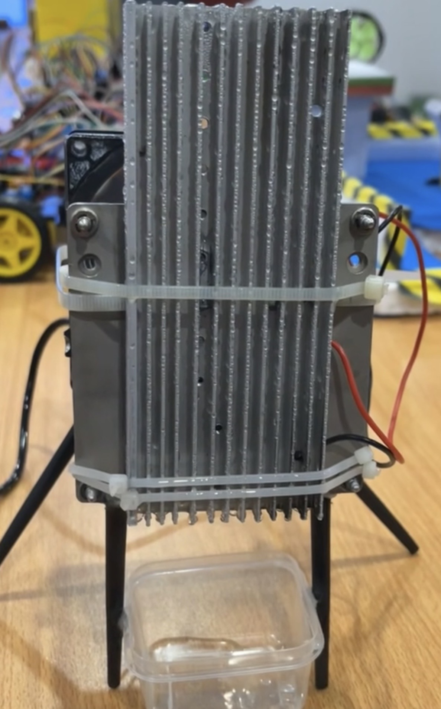
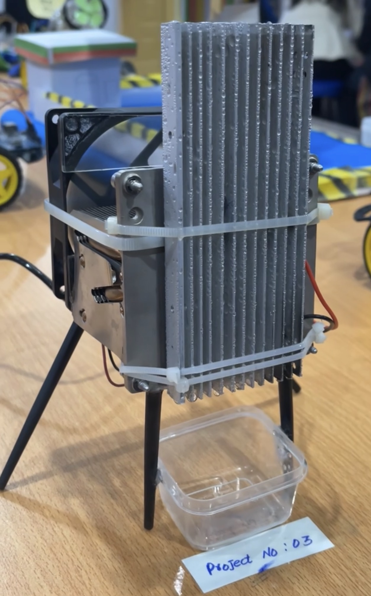
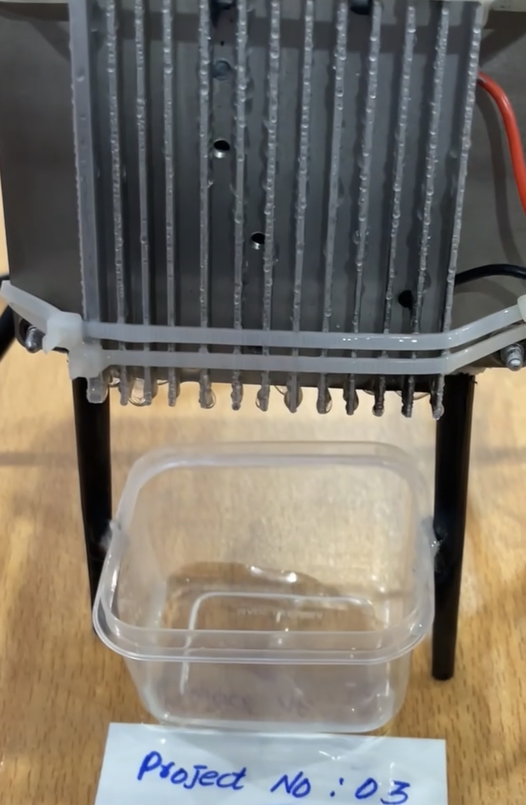

<div align="center">

# 💧 Water Extractor from Air


### *Harvesting water from thin air — using the power of thermoelectrics.*

</div>

---

## 🌊 Overview

This project is a **mini Atmospheric Water Generator (AWG)** that extracts moisture directly from ambient air and converts it into liquid water droplets — **no coding required**, purely electronics and thermodynamics.

It showcases the practical application of the **Peltier (thermoelectric) effect** to cool a surface below the **dew point**, causing water vapor in the air to condense and drip into a collection container.

---

## 📸 Gallery

<div align="center">

<table>
  <tr>
    <td align="center" width="33%"><br/><sub><b>Front View</b></sub></td>
    <td align="center" width="33%"><br/><sub><b>Side View</b></sub></td>
    <td align="center" width="33%"><br/><sub><b>Full Assembly</b></sub></td>
  </tr>
</table>

> 💦 Water droplets visibly forming on the heatsink fins — proof it works!

</div>

---

## ⚙️ How It Works

<div align="center">

| Step | Component | What Happens |
|:----:|-----------|-------------|
| 1️⃣ | **Cooling Fan** | Blows humid air across the cold heatsink |
| 2️⃣ | **Peltier Module** | Makes one side ice-cold, other side hot |
| 3️⃣ | **Cold Heatsink** | Surface drops below dew point → moisture condenses |
| 4️⃣ | **Gravity** | Water droplets slide down fins |
| 5️⃣ | **Collection Container** | Catches all the extracted water |
| 6️⃣ | **Hot Heatsink + Thermal Paste** | Exhausts heat away to keep system efficient |

</div>

```
  🌫️ Humid Air  ──►  🌀 Fan  ──►  ❄️ Cold Heatsink  ──►  💧 Droplets  ──►  🪣 Container
```

---

## 🔩 Components

| Component | Role |
|-----------|------|
| **Peltier Module (TEC1-12706)** | Creates cold & hot sides via thermoelectric effect |
| **Aluminum Heatsink × 2** | Cold: condenses water · Hot: dissipates heat |
| **Cooling Fan** | Pushes airflow over cold heatsink |
| **Thermal Paste** | Maximizes heat transfer between Peltier & heatsinks |
| **DC Power Wires (Red/Black)** | 12V power supply connection |
| **Metal Stand (4 legs)** | Elevates unit for water to drip into container |
| **Plastic Container** | Collects condensed water |
| **Bolts, Zip Ties & Brackets** | Mechanical assembly |

---

## 🛠️ Build Steps

**Step 1 — Peltier Setup**
Apply thermal paste on both faces of the Peltier module for maximum thermal contact.

**Step 2 — Mount Heatsinks**
Attach one heatsink to the cold side (condensation surface) and one to the hot side. Secure with bolts and metal brackets.

**Step 3 — Attach Fan**
Mount the cooling fan on the hot side heatsink to actively exhaust heat. Connect fan wires with Peltier power wires.

**Step 4 — Assemble Frame**
Mount the full assembly onto the 4-legged metal stand with enough clearance below for water to drip freely.

**Step 5 — Place Container**
Position the plastic container directly under the cold heatsink fins.

**Step 6 — Power On**
Connect to a **12V DC** power supply. Within minutes, condensation will form on the heatsink fins and begin dripping.

---

## 📊 Specifications

| Parameter | Value |
|-----------|-------|
| Operating Voltage | 12V DC |
| Peltier Module | TEC1-12706 |
| Condensation Method | Dew Point via Thermoelectric Cooling |
| Water Output | Varies with ambient humidity & temperature |
| Coding Required | None |

---

## ✅ Results

> After powering the device, **visible water droplets** formed on the heatsink fins within minutes. Droplets accumulated and dripped into the collection container — confirming successful **moisture extraction from ambient air**.

---

## 🌍 Real-World Applications

- 🏜️ Water harvesting in dry/arid regions
- 🏕️ Off-grid and survival water generation
- 🌱 Small-scale irrigation in remote areas
- 💡 Proof-of-concept for large-scale AWG systems
- 🎓 Educational demonstration of thermoelectric effects

---

## 🚀 Future Improvements

- [ ] Add **DHT11/DHT22** humidity & temperature sensor with LCD display
- [ ] Use a **larger Peltier module** for increased water output
- [ ] Integrate a **solar panel** for fully off-grid operation
- [ ] Add **water level sensor** with LED indicator
- [ ] Design a **3D-printed enclosure**

---

## 📁 Repository Structure

```
atmospheric-water-generator/
├── images/
│   ├── Img_1.jpg       # Bottom view — water dripping into container
│   ├── Img_2.jpg       # Side view — full assembly with fan
│   └── Img_3.jpg       # Front view — condensation on fins
└── README.md
```

---

## 📚 References

- [Thermoelectric / Peltier Effect — Wikipedia](https://en.wikipedia.org/wiki/Thermoelectric_effect)
- [Atmospheric Water Generation — Wikipedia](https://en.wikipedia.org/wiki/Atmospheric_water_generator)
- [Dew Point — Wikipedia](https://en.wikipedia.org/wiki/Dew_point)

---

<div align="center">

## 👤 Author

**Huda Usman**

[](https://www.linkedin.com/in/hudausman010)

*"Turning air into water — one electron at a time."*

---

⭐ **If you found this project interesting, please give it a star!** ⭐

</div>
